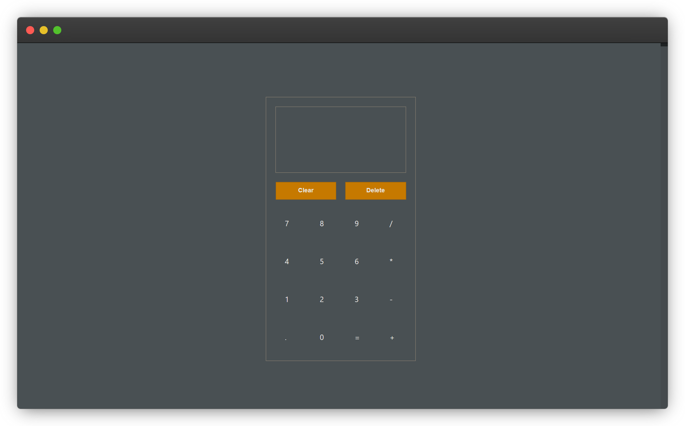
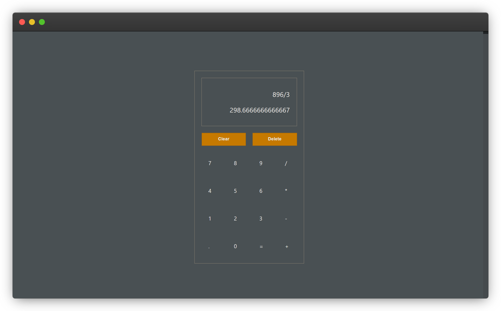

# Calculator

A simple and easy-to-use calculator created using HTML, CSS and Javascript
This project is part of [Foundations Course of Odin Project](https://www.theodinproject.com/paths/foundations/courses/foundations). You can view the entire project statement [here](https://www.theodinproject.com/lessons/foundations-calculator).

## Tools and Technologies:
* HTML
* CSS
* Javascript
    1. Javascript Fundamentals - datatypes, loops, conditional statements etc.
    2. Arrays in Javascript (and built-in array methods)
    3. Strings in Javascript
    4. DOM (Document Object Model) Manipulation and Events
    5. Chrome DevTools

## Screenshots

Here are some screenshots of the project:

## Authors

Deep Narayan

## License

    Copyright [2022] [Deep Narayan]

    Licensed under the Apache License, Version 2.0 (the "License");
    you may not use this file except in compliance with the License.
    You may obtain a copy of the License at

        http://www.apache.org/licenses/LICENSE-2.0

    Unless required by applicable law or agreed to in writing, software
    distributed under the License is distributed on an "AS IS" BASIS,
    WITHOUT WARRANTIES OR CONDITIONS OF ANY KIND, either express or implied.
    See the License for the specific language governing permissions and
    limitations under the License.

